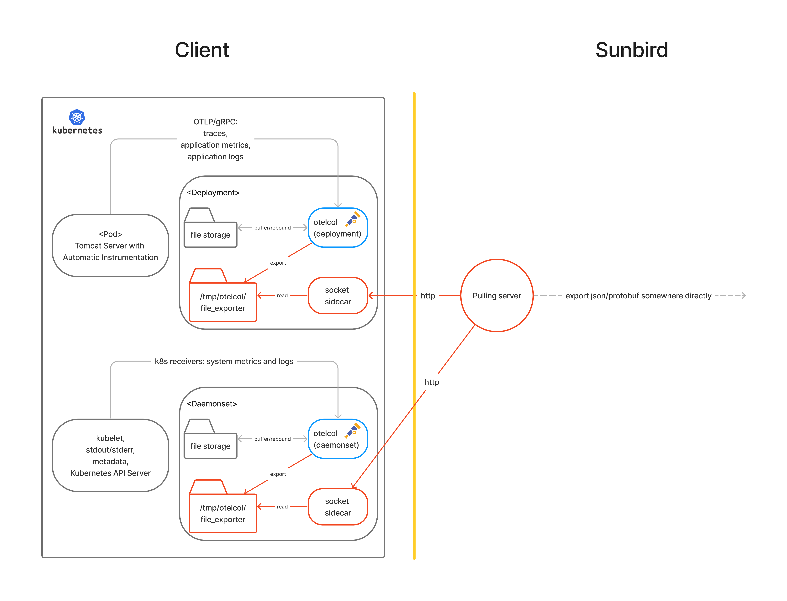

# Sunbird-OpenTelemetry (pull)

## Objective
> The pull style solution for Sunbird-OpenTelemetry

- take <a href="https://github.com/mybatis/jpetstore-6">jpetstore</a> as application
- Minikube to simulate a kubernetes cluster

## Architechture


## Directory
```
+-- cluster-configs (Cluster configuration Yaml files) 
+-- custom-otelcol (custom collectors which deployed inside the cluster)
+-- jpetstore-6
+-- mysql (dockerfile for mysql)
+-- otelcol (Opentelemetry Collector)
+-- record
+-- socketClient
+-- delete.sh
+-- deploy.sh
+-- README.md
```

## Run
* After you launch the cluster, you can run run the socketClient to actively pull telemetry from the cluster
```
cd socketClient
node index.js
```
* and then, send messages like below to request for telemetry
```
requestTraces
requestMetrics
requestLogs
```
* if there are telemetry in the cluster, you will be able to see them in the ./socketClient/receivedData
* you may need to run ***npm install*** and create a ./socketClient/receivedData directory in advance
