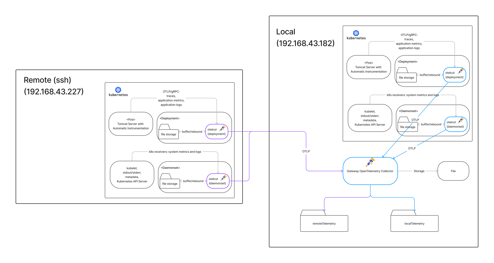

# Sunbird-OpenTelemetry (multi-site)

## Objective
> The multi-site stream segregation solution for Sunbird-OpenTelemetry

- take <a href="https://github.com/mybatis/jpetstore-6">jpetstore</a> as application
- Minikube to simulate a kubernetes cluster

## Architechture


## Directory
```
.
+-- cluster-configs (Cluster configuration Yaml files) 
+-- custom-otelcol (custom collectors which deployed inside the cluster)
+-- jpetstore-6
+-- mysql (dockerfile for mysql)
+-- otelcol (Opentelemetry Collector)
+-- record
+-- tomcat
+-- delete.sh
+-- deploy.sh
+-- README.md
```

## Don't run this branch
this branch is only for demostration.
if you want to run this project, see master branch

## Demo
please see https://youtu.be/KV4LdazyZaE
