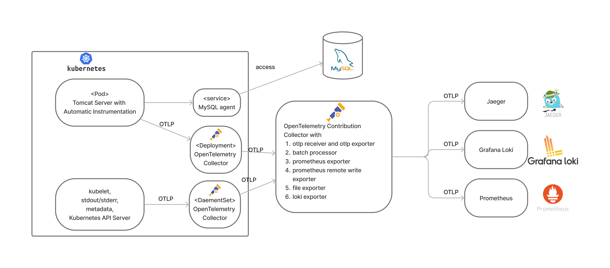

# Sunbird-OpenTelemetry

## Objective
> Obtain observability of an application running in kubernetes environment while accessing an externel MySQL with OpenTelemetry and some observability backend.

- take <a href="https://github.com/mybatis/jpetstore-6">jpetstore</a> as application
- Minikube to simulate a kubernetes cluster

## Architechture


## Directory
```
.
+-- cluster-configs (Cluster configuration Yaml files) 
+-- grafanaloki (Grafana docker compose file)
+-- jpetstore-6
+-- open-telemetry (Opentelemetry helm charts for support in kubernetes)
+-- otelcol (Opentelemetry Collector)
+-- prometheus-2.47.0 (Prometheus)
+-- record
|   +-- Sunbird-Opentelemetry-Arch.png
+-- delete.sh
+-- deploy.sh
+-- README.md
```

## Requirements
- Minikube
- Docker (with user in the group 'docker', it is the requirement to run minikube with docker engine)
- Helm ( to run Opentelemetry charts)
- Prometheus (Download from https://prometheus.io/download/)

## How to run

First of all, we do not recommend you to try to run the cluster on your node because of its complexity, but if you really want to run the cluster, follow the steps below.
- ### Clone
```
git clone https://github.com/roychshao/Sunbird.git
```


- ### Modify ./deploy.sh in the root of this directory
> we use environment variable to replace the cluster configs. So make sure you have <font style="background: #ADADAD; color: #FFFFFF"> envsubst </font>, if not, see <a>https://command-not-found.com/envsubst</a> and install it.

in my dockerhub: roychshao, there are two docker images built on amd-64 and arm-64 systems, if your system is the same architechture with these two, just modify image name, else, you have two rebuild docker image in /tomcat directory and modify DOCKERHUB_USERNAME to yours.
```
export DOCKERHUB_USERNAME=roychshao // if your system architechture is amd-64 or arm-64
export IMAGE_NAME=sunbird-ap-amd64 (sunbird-ap-arm64 or yours)
export MYSQL_ADDR=<your ip address>
```

- ### Modify ip-address where collectors in kubernetes environment sends to
```
cd ./open-telemetry
// modify deployment.yaml and daemenset.yaml in the config.exporter.otlp.endpoint to your otelcol's address
// for multitenant, multiple datasources may be configured, the port now is 4317 for the first datasource, 55690 for the second
```

- ### Running observability backends
in this step, you may need to open several terminals for each backend

- Prometheus:  
> use ./prometheus-2.47.0/prometheus.yml to executes downloaded prometheus binary file
```
./prometheus --config.file=prometheus.yml
```

- Grafana loki
```
cd ./grafanaloki
docker compose up -d
```
don't forget to add loki datasource in grafana and set endpoint to http://loki:3100

- Jaeger
```
docker run -d --name jaeger \
  -e COLLECTOR_ZIPKIN_HOST_PORT=:9411 \
  -e COLLECTOR_OTLP_ENABLED=true \
  -p 6831:6831/udp \
  -p 6832:6832/udp \
  -p 5778:5778 \
  -p 16686:16686 \
  -p 4317:6000 \
  -p 4318:6001 \
  -p 14250:14250 \
  -p 14268:14268 \
  -p 14269:14269 \
  -p 9411:9411 \
  jaegertracing/all-in-one:1.48
```

- Opentelemetry Collector
```
cd otelcol
./otelcol --config=config.yaml
```

- ### Start Minikube
```
minikube start
./deploy.sh
minikube service tomcat-service
```

Now the cluster is finished and you can visit them with browser.  
Jpetstore: by minikube service  
Jaeger: http://localhost:16686  
Prometheus: http://localhost:9090  
Grafana: http://localhost:3000  

Finally, close the cluster by
```
./delete.sh
minikube stop
```
