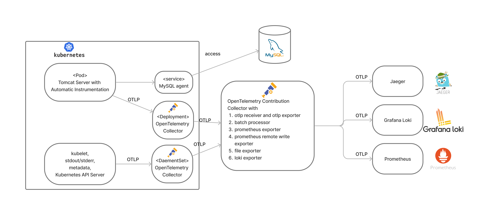

# Sunbird-OpenTelemetry

## Objective
> Obtain observability of an application running in kubernetes environment while accessing an externel MySQL with OpenTelemetry and some observability backend.

- take <a href="https://github.com/mybatis/jpetstore-6">jpetstore</a> as application
- Minikube to simulate a kubernetes cluster

## Architechture


## Directory
```
.
+-- cluster-configs (Cluster configuration Yaml files) 
+-- grafanaloki (Grafana docker compose file)
+-- jpetstore-6
+-- open-telemetry (Opentelemetry helm charts for support in kubernetes)
+-- otelcol (Opentelemetry Collector)
+-- prometheus-2.47.0 (Prometheus)
+-- record
|   +-- Sunbird-Opentelemetry-Arch.png
+-- delete.sh
+-- deploy.sh
+-- README.md
```

## Requirements
- Minikube
- MySQL
- Helm ( to run Opentelemetry charts)
- Prometheus (Download from https://prometheus.io/download/)

## How to run

First of all, we do not recommend you to try to run the cluster on your node because of its complexity, but if you really want to run the cluster, follow the steps below.
- ### Clone
```
git clone https://github.com/roychshao/Sunbird.git
```

- ### Pre-config MySQL and update jpetstore.war
```
/* first login mysql */
mysql> source ./jpetstore-6/src/main/resources/database/jpetstore-hsqldb-schema.sql
mysql> source ./jpetstore-6/src/main/resources/database/jpetstore-hsqldb-dataload.sql
```

and you need to modified ./jpetstore-6/src/main/resources/db.properties

```
spring.datasource.driver-class-name=com.mysql.cj.jdbc.Driver
spring.datasource.url=<your mysql url>
spring.datasource.username=<your mysql username>
spring.datasource.password=<your mysql password>
```
generate jpetstore.war and put it to ./tomcat

```
/* in ./jpetstore-6 */
./mvnw clean package
./mvnw cargo:run -P tomcat90
cp ./target/jpetstore.war ./../tomcat
cd ..
```

- ### Rebuild docker image
```
cd ./tomcat
docker build -t <your-image-name> .
```
It may take times, after finished, do
```
docker tag <your-image-name> <your-dockerhub-username>/<your-image-name>:latest
docker push <your-dockerhub-username>/<your-image-name>:latest
cd ..
```

also need to modified below files

./cluster-configs/tomcat.yaml
```
- image: <your-dockerhub-username>/<your-image-name>:latest
```

./cluster-configs/mysqlagent.yaml
```
- ip: <your node ip which executes externel mysql> /* for running minikube, the externel MySQL may locates on the same node */ 
```

- ### Running observability backends
in this step, you may need to open several terminals for each backend

- Prometheus:  
> use ./prometheus-2.47.0/prometheus.yml to executes downloaded prometheus binary file
```
./prometheus --config.file=prometheus.yml
```

- Grafana loki
```
cd ./grafanaloki
docker compose up -d
```

- Jaeger
```
docker run -d --name jaeger \
  -e COLLECTOR_ZIPKIN_HOST_PORT=:9411 \
  -e COLLECTOR_OTLP_ENABLED=true \
  -p 6831:6831/udp \
  -p 6832:6832/udp \
  -p 5778:5778 \
  -p 16686:16686 \
  -p 4317:6000 \
  -p 4318:6001 \
  -p 14250:14250 \
  -p 14268:14268 \
  -p 14269:14269 \
  -p 9411:9411 \
  jaegertracing/all-in-one:1.48
```

- Opentelemetry Collector
```
cd otelcol
./otelcol --config=config.yaml
```

- ### Start Minikube
```
minikube start
./deploy.sh
minikube service tomcat-service
```

Now the cluster is finished and you can visit them with browser.  
Jpetstore: by minikube service  
Jaeger: http://localhost:16686  
Prometheus: http://localhost:9090  
Grafana: http://localhost:3000  

Finally, close the cluster by
```
./delete.sh
minikube stop
```
